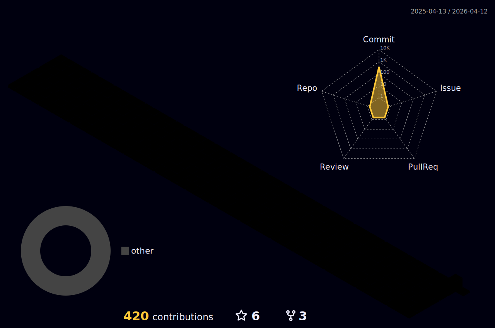

 

### 🌱 I’m currently learning ...

   

    
  
 

 
 

 
 

 
## Projects     

 - <a href="https://github.com/Greeddk/TaxiParty">개인프로젝트 - TaxiParty(택시합승 플랫폼 / iOS)</a>
 - <a href="https://github.com/Greeddk/UQuiz">개인프로젝트 - UQuiz(영화 제목 퀴즈 앱 / iOS)</a>
 - <a href="https://github.com/Greeddk/TodayCoin">개인프로젝트 - 오늘의 코인(가상화폐, NFT 정보 조회 앱 / iOS)</a>
 - <a href="https://github.com/Greeddk/WhattoWatch">개인프로젝트 - 뭐볼까(인기 TV 프로그램 / 영화 정보 조회 앱 / iOS)</a>
 - <a href="https://github.com/Greeddk/WWDC24">WWDC2024 Student Challenge - FeelTheHangeul(한글 자모 공부앱 / iPadOS)</a>
 - <a href="https://github.com/Deepple-ADA/SaE.KIOSK">대한민국 SW 융합 해커톤 대회 Team Deepple - 새키오스크(베리어프리 키오스크 / iPadOS / 우수상 수상)</a>
 - <a href="https://github.com/Greeddk/Blank">애플디벨로퍼아카데미 Macro - Blank(암기를 도와주는 테스트앱 / iPadOS)</a>
 - <a href="https://github.com/Greeddk/MC3-Team11-Naughtya/tree/main">애플디벨로퍼아카데미 MC3 - Epilog(프로젝트 기반 투두 앱 / MacOS)</a>
 - <a href="https://github.com/MC2-Team7">애플디벨로퍼아카데미 MC2 - ChopChop(육아용 인터렉션 앱 / iPadOS)</a>
 - <a href="https://github.com/Greeddk/WWDC2023">WWDC2023 Student Challenge - 사다리게임(iPadOS)</a>
 
 

  

 
  
