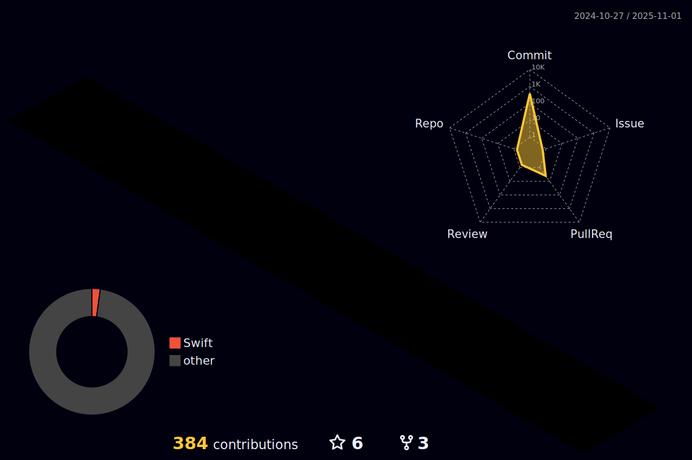

### 👨🏻‍💻  About Me

 

### 🌱 I’m currently learning ...

   

    
  
 

 
 

 
 

 
## Projects     
 - <a href="https://github.com/Greeddk/WWDC2023">WWDC2023 Student Challenge - 사다리게임</a>
 - <a href="https://github.com/Greeddk/BoxWorld.git">애플디벨로퍼아카데미 MC1 - BoxWorld(우리들의 CBL이야기)</a>
 - <a href="https://github.com/MC2-Team7">애플디벨로퍼아카데미 MC2 - ChopChop(육아용 인터렉션 앱)</a>
 - <a href="https://github.com/Greeddk/MC3-Team11-Naughtya/tree/main">애플디벨로퍼아카데미 MC3 - Epilog(프로젝트 기반 투두 앱 / 맥앱)</a>
 - <a href="https://github.com/Deepple-ADA/SaE.KIOSK">대한민국 SW 융합 해커톤 대회 Team Deepple - 새키오스크(베리어프리 키오스크 / 우수상 수상)</a>

 
 

  
